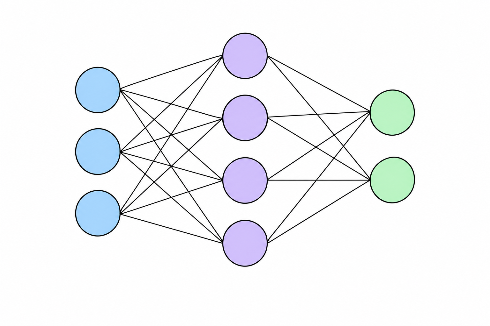
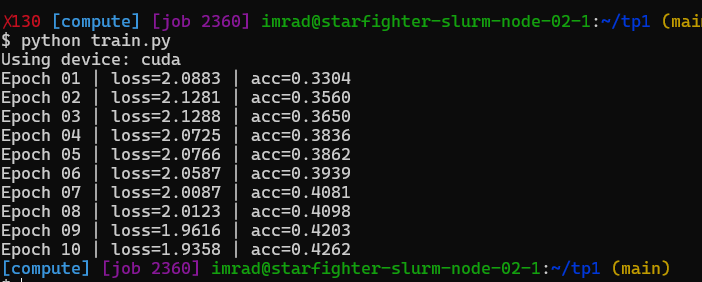
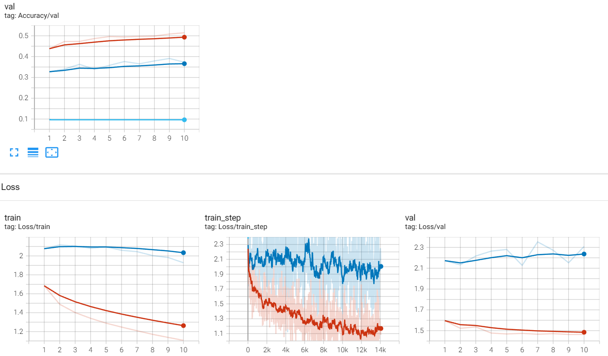
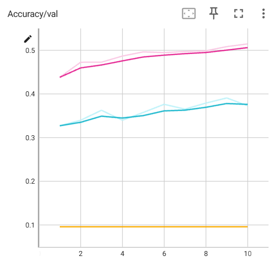

# TP1 — Introduction au Deep Learning

**Étudiant :** Imtiez Mrad
**Formation :** Télécom SudParis
**Cours :** CSC8607 — Introduction au Deep Learning

---

# Exercice 1 — SLURM

## 1.1 Connexion au cluster et environnement de travail

Le travail est réalisé sur le cluster de calcul de Télécom SudParis.

Après connexion au cluster, le dépôt du TP est disponible dans :

```bash
~/tp1
```

L'organisation principale du projet est la suivante :

```text
tp1/
├── data/
├── data2/
├── runs/
├── check_gpu.py
├── train.py
├── train_tb.py
├── mlp_model.pth
├── environment.yml
└── README.md
```

Les machines de connexion servent principalement aux opérations légères comme l'édition des fichiers, la compilation ou la soumission des jobs. Les calculs utilisant le GPU doivent être exécutés sur les nœuds de calcul.

`nvidia-smi` lancée directement sur le controller ne fonctionne pas car il ne possède pas de GPU accessible.

---

## 1.2 Allocation interactive d'un GPU

Une allocation interactive peut être obtenue avec `srun`.

Par exemple :

```bash
srun 
     --partition=gpu \
     --gres=gpu:1 \
     --time=01:00:00 \
     --cpus-per-task=1 \
     --mem=8G \
     --pty bash
```

Une fois sur le nœud de calcul, la commande suivante permet de vérifier le GPU disponible :

```bash
nvidia-smi
```

Résultat observé :

```text
GPU: NVIDIA L4
Memory: 23034 MiB
Driver Version: 595.84
CUDA Version: 13.2
```

Le GPU utilisé pour les expériences est donc une **NVIDIA L4**.

---

## 1.3 Gestion des jobs avec `squeue` et `scancel`

La commande suivante permet d'afficher les jobs de l'utilisateur :

```bash
squeue -u $USER
```

Pour annuler un job, on utilise :

```bash
scancel 1595
```

où `1595` correspond à l'identifiant du job affiché par `squeue`.

---

## 1.4 Soumission d'un job avec `sbatch`

Un script `hello.sh` a été utilisé pour tester la soumission d'un job SLURM :

```bash
#!/bin/bash

#SBATCH --partition=gpu
#SBATCH -t 01:00:00
#SBATCH --gres=gpu:1
#SBATCH --cpus-per-task=1
#SBATCH --mem=8G
#SBATCH -J hello-slurm
#SBATCH -o logs/%x-%j.out
#SBATCH -e logs/%x-%j.err

set -euo pipefail

mkdir -p logs

echo "Job ID: $SLURM_JOB_ID"
echo "Node: $(hostname)"
date

nvidia-smi || echo "nvidia-smi unavailable"

echo "Bonjour depuis SLURM !"
```

Le job a été soumis avec :

```bash
sbatch hello.sh
```

Le job obtenu était le **job 1596**.

Le fichier de sortie généré est :

```text
logs/hello-slurm-1596.out
```

Le job a été exécuté sur :

```text
starfighter-slurm-node-04-1
```

La sortie contient notamment les informations du GPU NVIDIA L4 ainsi que :

```text
Bonjour depuis SLURM !
```

Le job s'est terminé avec l'état :

```text
COMPLETED
```

Le fichier d'erreur associé ne contient pas d'erreur significative.

---

## 1.5 Consultation des ressources utilisées avec `sacct`

La commande utilisée pour consulter les jobs est :

```bash
sacct -u imrad \
      --starttime=2026-09-15 \
      --format=JobID,Partition,State,Elapsed,MaxRSS,ReqMem,ReqCPUS
```


`ReqMem` correspond à la quantité de mémoire demandée lors de la soumission du job, tandis que `MaxRSS` correspond à la quantité maximale de mémoire effectivement utilisée pendant son exécution.

---

# Exercice 2 — Environnement Python et GPU

## 2.1 Création de l'environnement

L'environnement Python utilisé pour le TP est `deeplearning`.

Création de l'environnement :

```bash
mamba create -n deeplearning python=3.10
```

Activation :

```bash
mamba activate deeplearning
```

Pour initialiser correctement `mamba` dans le shell :

```bash
source ~/miniforge3/etc/profile.d/conda.sh
eval "$(mamba shell hook --shell bash)"
```

La version utilisée est :

```text
Python 3.10.21
```

Le Python utilisé correspond à celui de l'environnement :

```text
~/miniforge3/envs/deeplearning/bin/python
```

---

## 2.2 Vérification de PyTorch et du GPU

Le script `check_gpu.py` permet de vérifier la disponibilité de CUDA :

```python
import torch

print("PyTorch:", torch.__version__)
print("CUDA available:", torch.cuda.is_available())
print("Device count:", torch.cuda.device_count())

if torch.cuda.is_available():
    print("Device:", torch.cuda.get_device_name(0))
```

Résultat :

```text
PyTorch: 2.5.1+cu121
CUDA available: True
Device count: 1
Device: NVIDIA L4
```

PyTorch détecte donc correctement le GPU.

---

## 2.3 Installation de PyTorch et CUDA

L'environnement utilise notamment :

```text
PyTorch 2.5.1+cu121
CUDA 12.1
```

La version CUDA utilisée par PyTorch peut être vérifiée avec :

```python
import torch

print(torch.version.cuda)
print(torch.cuda.is_available())
```

Résultat :

```text
12.1
True
```

Il faut distinguer cette version CUDA utilisée par PyTorch de la version CUDA affichée par `nvidia-smi`, qui correspond à la compatibilité maximale supportée par le driver installé sur le nœud.

---

## 2.4 Vérification de l'accélération GPU

Lorsque CUDA est disponible, le modèle peut être déplacé sur le GPU avec :

```python
device = torch.device("cuda" if torch.cuda.is_available() else "cpu")
```

Dans notre environnement :

```text
CUDA available: True
Device count: 1
NVIDIA L4
```

Le GPU peut donc être utilisé pour l'entraînement des réseaux de neurones.

---

## 2.5 Fichier `environment.yml`

Les principales dépendances de l'environnement sont définies dans `environment.yml`.

L'environnement utilise notamment :

```yaml
name: deeplearning

dependencies:
  - python=3.10
  - pytorch
  - pytorch-cuda=12.1
  - tensorboard
  - torchaudio
  - torchvision
```

---

## 2.6 TensorBoard

La version de TensorBoard utilisée est :

```text
TensorBoard 2.20.0
```

---

# Exercice 3 — Réseaux de neurones et rétropropagation


## 3.1 Nombre de paramètres d'un MLP

On considère un MLP composé de :

```text
3 → 4 → 2
```

La première couche contient :

$$
3 \times 4 = 12
$$

poids.

La deuxième couche contient :

$$
4 \times 2 = 8
$$

poids.

Le nombre total de poids est donc :

$$
12 + 8 = 20
$$

En ajoutant les biais :

* première couche : 4 biais ;
* deuxième couche : 2 biais.

On obtient donc :

$$
20 + 4 + 2 = 26
$$

paramètres.

---

## 3.2 Propagation avant

Pour un MLP avec une couche cachée, la propagation avant peut s'écrire :

$$
h = f(W_1x+b_1)
$$

puis :

$$
y = W_2h+b_2
$$

Pour un vecteur d'entrée de dimension 3 :

$$
x \in \mathbb{R}^{3}
$$

avec une couche cachée de dimension 4 :

$$
h \in \mathbb{R}^{4}
$$

et une sortie de dimension 2 :

$$
y \in \mathbb{R}^{2}
$$

Les dimensions des matrices sont donc :

$$
W_1 \in \mathbb{R}^{4\times3}
$$

et

$$
W_2 \in \mathbb{R}^{2\times4}
$$

---

## 3.3 Calcul des gradients

On considère :

$$
f(x,y,z)=\frac{x}{y}+z
$$

avec :

$$
q=\frac{x}{y}
$$

Pour :

$$
x=2,\quad y=4,\quad z=0
$$

on obtient :

$$
q=\frac{2}{4}=0.5
$$

et donc :

$$
f=0.5
$$

Les dérivées sont :

$$
\frac{\partial f}{\partial x}=\frac{1}{y}
$$

$$
\frac{\partial f}{\partial y}=-\frac{x}{y^2}
$$

$$
\frac{\partial f}{\partial z}=1
$$

Ainsi :

$$
\frac{\partial f}{\partial x}=0.25
$$

$$
\frac{\partial f}{\partial y}=-0.125
$$

$$
\frac{\partial f}{\partial z}=1
$$

---

## 3.4 Mise à jour par descente de gradient

Avec un taux d'apprentissage :

$$
\eta=1
$$

la mise à jour est :

$$
x'=x-\eta\frac{\partial f}{\partial x}
$$

$$
y'=y-\eta\frac{\partial f}{\partial y}
$$

$$
z'=z-\eta\frac{\partial f}{\partial z}
$$

On obtient :

$$
x'=2-0.25=1.75
$$

$$
y'=4-(-0.125)=4.125
$$

$$
z'=0-1=-1
$$

Après la mise à jour :

$$
f'=\frac{1.75}{4.125}-1\approx -0.5758
$$

---

## 3.5 Rétropropagation et mini-batches

La rétropropagation permet de calculer les gradients des paramètres du réseau en appliquant la règle de la chaîne depuis la fonction de perte jusqu'aux différentes couches.

Pour un mini-batch, le gradient utilisé pour mettre à jour les paramètres est généralement calculé à partir de l'ensemble des exemples du batch.

Cela permet de trouver un compromis entre :

* le calcul sur un seul exemple, très bruité ;
* le calcul sur l'ensemble du dataset, plus coûteux.

---

## 3.6 Type de tâche, sortie et fonction de perte

| Tâche                        | Sortie du réseau   | Fonction de perte    |
| ---------------------------- | ------------------ | -------------------- |
| Classification binaire       | 1 logit            | Binary Cross Entropy |
| Classification multi-classes | 1 logit par classe | Cross Entropy        |
| Régression                   | Valeur continue    | MSE                  |

Pour la classification multi-classes utilisée avec CIFAR-10, le réseau produit un logit par classe et utilise `CrossEntropyLoss`.

---

# Exercice 4 — Premier réseau de neurones

## 4.1 Chargement de CIFAR-10

Le dataset utilisé est **CIFAR-10**.

Il contient :

* 50 000 images d'entraînement ;
* 10 000 images de test ;
* 10 classes ;
* des images RGB de taille `32 × 32`.

Les images sont normalisées avant d'être fournies au réseau.

Les `DataLoader` utilisés sont configurés avec :

```python
batch_size = 32
```

Pour l'entraînement :

```python
shuffle=True
```

Pour le test :

```python
shuffle=False
```

Le mélange des données d'entraînement permet d'éviter que le réseau voie toujours les exemples dans le même ordre.

---

## 4.2 Architecture du MLP

Les images CIFAR-10 ont une dimension :

$$
32\times32\times3=3072
$$

L'image est donc aplatie avant d'être donnée au MLP.

L'architecture utilisée est :

```text
3072 → 128 → 10
```

avec :

* 3072 neurones d'entrée ;
* 128 neurones dans la couche cachée ;
* 10 sorties correspondant aux 10 classes de CIFAR-10.


La sortie finale contient directement les logits.

Il ne faut donc pas appliquer de `Softmax` avant `CrossEntropyLoss`, car `CrossEntropyLoss` applique déjà la transformation nécessaire en interne.

---

## 4.3 Entraînement du premier MLP

Le modèle est entraîné avec :

```python
device = torch.device("cuda" if torch.cuda.is_available() else "cpu")
model = model.to(device)
```

La fonction de perte utilisée est :

```python
criterion = nn.CrossEntropyLoss()
```

L'optimiseur est :

```python
optimizer = torch.optim.SGD(
    model.parameters(),
    lr=0.01,
    momentum=0.9
)
```

L'entraînement est réalisé pendant 10 epochs.

Les résultats obtenus sont présentés dans la capture suivante :



Les principales étapes d'une itération d'entraînement sont :

```python
optimizer.zero_grad()
outputs = model(images)
loss = criterion(outputs, labels)
loss.backward()
optimizer.step()
```

`zero_grad()` remet les gradients à zéro.

`backward()` calcule les gradients par rétropropagation.

`step()` met à jour les paramètres du modèle.

---

## 4.4 Évaluation sur le jeu de test

Après l'entraînement, le modèle est placé en mode évaluation :

```python
model.eval()
```

Puis les gradients sont désactivés :

```python
with torch.no_grad():
    ...
```

Cela permet de réduire la consommation mémoire et d'éviter de construire le graphe de calcul nécessaire à la rétropropagation.

Pour CIFAR-10, une classification aléatoire donnerait environ :

$$
\frac{1}{10}=10\%
$$

de précision.

---

## 4.5 Sauvegarde du modèle

Le modèle peut être sauvegardé avec :

```python
torch.save(model.state_dict(), "mlp_model.pth")
```

Le fichier obtenu est :

```text
mlp_model.pth
```

Il peut ensuite être rechargé avec :

```python
model.load_state_dict(torch.load("mlp_model.pth"))
```

---

# Exercice 5 — TensorBoard

## 5.1 Organisation des runs

Pour identifier facilement les différentes expériences, le nom des runs contient notamment :

* le type de modèle ;
* le batch size ;
* le learning rate ;
* la date et l'heure.

Par exemple :

```text
runs/MLP/bs32_lr0.001_20260920-104126
```

---

## 5.2 Métriques enregistrées

Les métriques suivantes sont enregistrées avec TensorBoard :

```text
Loss/train
Loss/train_step
Loss/val
Accuracy/val
```

Une séparation de 90 % / 10 % est utilisée pour obtenir respectivement les données d'entraînement et de validation.

La seed utilisée est :

```text
seed = 0
```

Le lissage utilisé dans TensorBoard est :

```text
smoothing = 0.6
```

---

## 5.3 Mini-sweep d'hyperparamètres

Trois entraînements ont été réalisés.

### Run 1

Configuration :

```text
Model: MLP
Batch size: 32
Learning rate: 0.01
Seed: 0
Weight decay: 0
```

Répertoire :

```text
runs/MLP/bs32_lr0.01_20260920-083441
```

Les courbes correspondantes sont disponibles dans TensorBoard.

---

### Run 2

Configuration :

```text
Model: MLP
Batch size: 32
Learning rate: 0.001
Seed: 0
Weight decay: 0
```

Répertoire :

```text
runs/MLP/bs32_lr0.001_20260920-104126
```

Résultats :

| Epoch | Train Loss | Validation Loss | Validation Accuracy |
| ----: | ---------: | --------------: | ------------------: |
|     1 |     1.6846 |          1.5960 |             43.82 % |
|     2 |     1.4892 |          1.5229 |             47.26 % |
|     3 |     1.4014 |          1.5360 |             47.28 % |
|     4 |     1.3404 |          1.4770 |             48.68 % |
|     5 |     1.2894 |          1.4683 |             49.64 % |
|     6 |     1.2477 |          1.4740 |             49.46 % |
|     7 |     1.2093 |          1.4658 |             49.72 % |
|     8 |     1.1714 |          1.4712 |             49.88 % |
|     9 |     1.1391 |          1.4639 |             50.84 % |
|    10 |     1.1074 |          1.4639 |             51.46 % |

La précision de validation finale est donc de :

```text
51.46 %
```

---

### Run 3

Configuration :

```text
Model: MLP
Batch size: 128
Learning rate: 0.1
Seed: 0
Weight decay: 0
```

Répertoire :

```text
runs/MLP/bs128_lr0.1_20260920-104639
```

Les pertes d'entraînement et de validation deviennent `NaN`.

La précision de validation reste proche d'une classification aléatoire :

```text
9.64 %
```

Cela indique que le learning rate de `0.1` est trop élevé pour cette configuration et entraîne une divergence numérique.

---

## 5.4 Visualisation TensorBoard

Les différents runs peuvent être comparés dans TensorBoard à partir des courbes enregistrées.

Les runs utilisés sont :

```text
bs32_lr0.01_20260920-083441
bs32_lr0.001_20260920-104126
bs128_lr0.1_20260920-104639
```

Les visualisations obtenues sont  :






---

## 5.5 Comparaison des résultats

Les trois configurations donnent les résultats suivants :

| Batch size | Learning rate | Validation Accuracy | Observation                                 |
| ---------: | ------------: | ------------------: | ------------------------------------------- |
|         32 |          0.01 |              ≈ 38 % | Apprentissage correct mais moins performant |
|         32 |         0.001 |         **51.46 %** | Meilleure convergence observée              |
|        128 |           0.1 |              9.64 % | Divergence / pertes `NaN`                   |

Dans les expériences réalisées, la configuration avec un batch size de `32` et un learning rate de `0.001` atteint la meilleure précision de validation observée, avec **51.46 %**.

---

## 5.6 Analyse du surapprentissage

Le surapprentissage peut être observé lorsque la perte d'entraînement continue de diminuer alors que la perte de validation augmente.

Pour le run avec :

```text
batch size = 32
learning rate = 0.001
```

la perte d'entraînement continue de diminuer jusqu'à la fin des 10 epochs :

```text
Epoch 9 : 1.1391
Epoch 10 : 1.1074
```

La perte de validation reste quant à elle pratiquement stable entre les dernières epochs :

```text
Epoch 9 : 1.4639
Epoch 10 : 1.4639
```

On observe donc une amélioration du modèle sur les données d'entraînement qui ne s'accompagne plus d'une amélioration de la perte de validation. Cela peut indiquer un début de surapprentissage ou simplement une stagnation de la généralisation, mais les 10 epochs ne suffisent pas à conclure à un surapprentissage important.

---

# Conclusion

Ce TP a permis de mettre en pratique l'utilisation de **SLURM**, de **PyTorch**, d'un **GPU NVIDIA L4** et de **TensorBoard** pour entraîner et analyser un MLP sur CIFAR-10.

Les expériences montrent notamment l'importance du choix du learning rate : `0.001` permet une convergence stable dans notre configuration, tandis que `0.1` entraîne une divergence avec des pertes `NaN`.

---

# Fichiers principaux

```text
tp1/
├── data/
├── data2/
├── runs/
├── check_gpu.py
├── train.py
├── train_tb.py
├── mlp_model.pth
├── environment.yml
└── README.md
```
