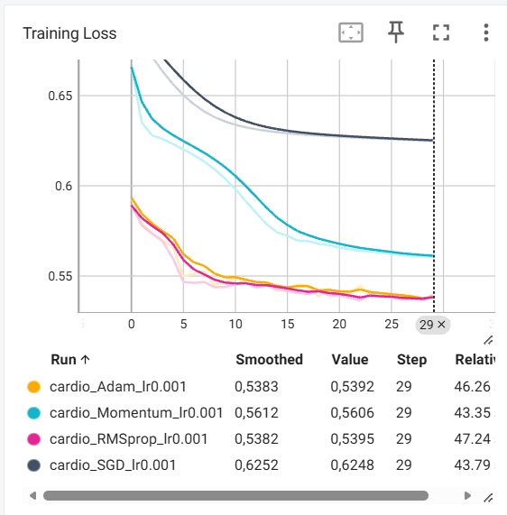

# TP2 — Régularisation, optimisation et métriques

## 1. Création d'un dataset personnalisé

### 1.1 Présentation

Dans cette première partie, nous avons implémenté un dataset PyTorch personnalisé à partir du jeu de données **Cardiovascular Disease**.

Le dataset est chargé depuis un fichier CSV puis prétraité avec Pandas. Les variables catégorielles sont transformées par one-hot encoding et les variables sont normalisées avec `StandardScaler`.

Les données sont ensuite séparées en trois sous-ensembles :

* 80 % pour l'entraînement ;
* 10 % pour la validation ;
* 10 % pour le test.

Le DataLoader utilise une taille de batch de 64.

### 1.2 Résultats

La taille totale du dataset est :

```text
70000
```

La forme d'un batch de features est :

```text
torch.Size([64, 16])
```

La forme d'un batch de labels est :

```text
torch.Size([64, 1])
```

Le dataset utilisé dans notre configuration contient donc **16 features** après le prétraitement.

### 1.3 Questions

#### 1. Pourquoi appliquer `StandardScaler` avant le split est-il une mauvaise pratique ?

Appliquer `StandardScaler` avant de séparer les données provoque une **fuite de données (data leakage)**.

En effet, le scaler calcule la moyenne et l'écart-type à partir de l'ensemble des données. Les informations provenant des ensembles de validation et de test sont donc utilisées indirectement pendant le prétraitement des données d'entraînement.

La bonne pratique consiste à :

1. séparer d'abord les données en train, validation et test ;
2. ajuster (`fit`) le `StandardScaler` uniquement sur les données d'entraînement ;
3. appliquer (`transform`) ce scaler aux données de validation et de test.

#### 2. Quelle classe utiliser si le dataset est trop volumineux pour tenir en RAM ?

Dans ce cas, on peut utiliser la classe `IterableDataset` de PyTorch.

Elle permet de charger et parcourir les données progressivement, sans devoir charger l'intégralité du dataset en mémoire.

---

# 2. Régularisation L1 et L2

## 2.1 Mise en place

Nous avons utilisé un réseau de neurones de type MLP composé de deux couches cachées de 128 neurones avec des activations ReLU, suivies d'une couche de sortie avec une activation Sigmoid.

Le modèle est entraîné avec une `BCELoss` et un optimiseur SGD.

Une première expérience a été réalisée avec :

```text
L1 = 0.0001
L2 = 0.001
Learning rate = 0.01
Epochs = 10
```

Les résultats obtenus sont :

| Epoch |   Loss | Accuracy |
| ----: | -----: | -------: |
|     1 | 0.8514 |   0.6133 |
|     2 | 0.8144 |   0.6444 |
|     3 | 0.7989 |   0.6506 |
|     4 | 0.7890 |   0.6537 |
|     5 | 0.7828 |   0.6561 |
|     6 | 0.7740 |   0.6590 |
|     7 | 0.7653 |   0.6622 |
|     8 | 0.7568 |   0.6649 |
|     9 | 0.7482 |   0.6695 |
|    10 | 0.7395 |   0.6742 |

La loss diminue progressivement tandis que l'accuracy augmente au cours de l'entraînement.

## 2.2 Questions

### 1. Que se passe-t-il avec une régularisation L1 trop forte ?

Une deuxième expérience a été réalisée avec :

```text
L1 = 0.1
L2 = 0
Learning rate = 0.01
Epochs = 10
```

Les résultats obtenus sont :

| Epoch |   Loss | Accuracy |
| ----: | -----: | -------: |
|     1 | 6.6640 |   0.4973 |
|     2 | 1.6340 |   0.5010 |
|     3 | 1.6340 |   0.5047 |
|     4 | 1.6340 |   0.5039 |
|     5 | 1.6340 |   0.4973 |
|     6 | 1.6340 |   0.5009 |
|     7 | 1.6340 |   0.4988 |
|     8 | 1.6340 |   0.5051 |
|     9 | 1.6340 |   0.4987 |
|    10 | 1.6340 |   0.5033 |

Avec une valeur de L1 aussi importante, la régularisation pénalise fortement les poids du modèle et les pousse vers zéro.

Le modèle n'arrive alors pratiquement plus à apprendre : l'accuracy reste proche de 50 % et la loss se stabilise rapidement.

Il s'agit d'un phénomène de **sous-apprentissage (underfitting)**.

### 2. Comment appliquer une régularisation L2 avec PyTorch ?

PyTorch permet d'appliquer automatiquement une régularisation L2 avec l'argument `weight_decay` des optimiseurs.

Par exemple :

```python
optimizer = optim.SGD(
    model.parameters(),
    lr=0.01,
    weight_decay=0.001
)
```

### 3. Quelle est la différence entre L1 et L2 ?

La régularisation L1 ajoute une pénalité proportionnelle à la valeur absolue des poids :

$$
L_1 = \lambda \sum |w|
$$

Elle favorise la parcimonie et peut pousser certains poids vers zéro.

La régularisation L2 ajoute une pénalité proportionnelle au carré des poids :

$$
L_2 = \lambda \sum w^2
$$

Elle pénalise davantage les grands poids et tend à les réduire, sans nécessairement les annuler complètement.

---

# 3. Comparaison des optimiseurs

## 3.1 Mise en place

L'entraînement a été encapsulé dans une fonction :

```python
train_model(optimizer_name, learning_rate, epochs)
```

Quatre optimiseurs ont été comparés avec :

```text
Learning rate = 0.001
Epochs = 30
```

Les optimiseurs testés sont :

* SGD ;
* SGD avec Momentum (`momentum=0.9`) ;
* RMSprop ;
* Adam.

La loss d'entraînement a été enregistrée à chaque epoch avec `SummaryWriter` afin de pouvoir visualiser les courbes dans TensorBoard.

## 3.2 Résultats

Les résultats obtenus sont :

| Optimiseur | Loss epoch 1 | Loss epoch 30 |
| ---------- | -----------: | ------------: |
| SGD        |       0.6913 |        0.6248 |
| Momentum   |       0.6659 |        0.5606 |
| RMSprop    |       0.5891 |        0.5395 |
| Adam       |       0.5935 |        0.5392 |

### 3.3 Courbes TensorBoard

Les quatre courbes de perte ont été superposées dans TensorBoard.



**Figure 1 — Courbes de perte d'entraînement des quatre optimiseurs dans TensorBoard.**

### 3.4 Quel optimiseur converge le plus rapidement initialement ?

D'après les résultats obtenus, **RMSprop** présente la diminution initiale de loss la plus rapide.

Sa loss passe de `0.5891` à `0.5468` dès la 6ᵉ epoch.

Adam présente également une convergence rapide. À l'inverse, SGD et Momentum diminuent leur loss de manière plus progressive.

### 3.5 Comparaison entre SGD et Momentum

Le SGD simple diminue progressivement la loss, passant de `0.6913` à `0.6248` après 30 epochs.

Avec Momentum, la loss passe de `0.6659` à `0.5606`.

L'ajout du momentum permet d'accélérer la descente de gradient en prenant en compte une partie des directions précédentes du gradient. Cela permet généralement de progresser plus rapidement dans les directions cohérentes et de réduire certains ralentissements de l'optimisation.

Dans notre expérience, le Momentum permet donc une diminution plus rapide et plus importante de la loss que le SGD simple.

---

# 4. Évaluation avec différentes métriques

## 4.1 Évaluation du modèle

Le modèle Adam a été réentraîné pendant 30 epochs avec :

```text
Learning rate = 0.001
```

Puis il a été évalué sur le jeu de test.

Les métriques obtenues sont :

| Métrique  | Valeur |
| --------- | -----: |
| Precision | 0.7602 |
| Recall    | 0.6910 |
| F1-score  | 0.7240 |
| AUC       | 0.8004 |

La dernière loss d'entraînement obtenue est :

```text
0.5326
```

## 4.2 Precision et Recall

La **Precision** mesure, parmi les exemples prédits comme positifs, la proportion d'exemples réellement positifs.

Le **Recall** mesure, parmi les exemples réellement positifs, la proportion que le modèle parvient à identifier correctement.

Dans notre expérience :

```text
Precision = 0.7602
Recall    = 0.6910
```

## 4.3 Pourquoi le Recall est-il important dans le contexte médical ?

Dans un contexte médical, le Recall est particulièrement important lorsqu'il est nécessaire de détecter le plus grand nombre possible de personnes réellement atteintes d'une maladie.

Un faux négatif correspond à une personne malade que le modèle classe comme non malade.

Un Recall élevé permet donc de réduire la proportion de personnes malades qui ne seraient pas détectées par le modèle.

Dans notre expérience, le Recall est de `0.6910`, ce qui signifie que le modèle identifie environ 69,1 % des exemples positifs du jeu de test avec le seuil de classification utilisé.

## 4.4 Que représente l'AUC ?

L'AUC (*Area Under the ROC Curve*) mesure la capacité du modèle à distinguer les deux classes en considérant différents seuils de classification.

La Precision, le Recall et le F1-score ont ici été calculés avec un seuil de classification fixé à `0.5`.

L'AUC permet au contraire d'évaluer la capacité de discrimination du modèle sur différents seuils, sans se limiter à un seul seuil de décision.

Le modèle obtient :

```text
AUC = 0.8004
```

sur le jeu de test.
